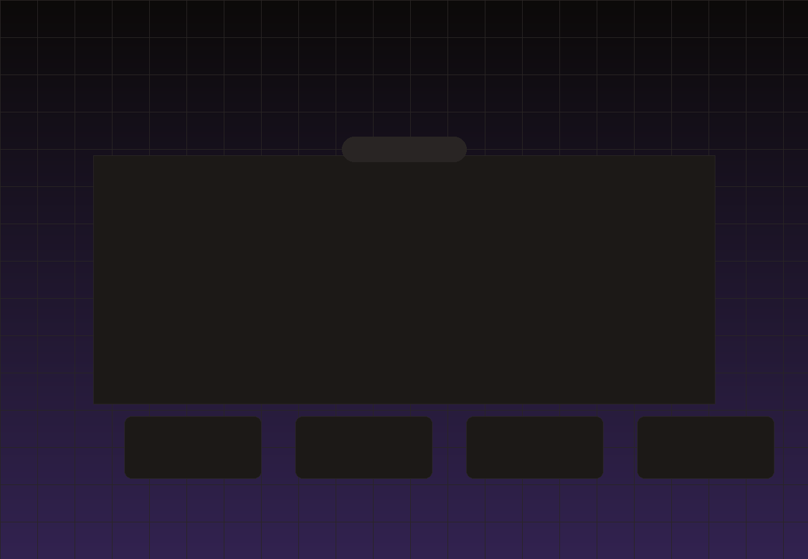

# DeStatic

**A premium Hugo theme for SaaS, Fintech & Web3 institutional one-page sites.**

Dark/light mode, design system, CMS, i18n, SEO, accessibility — all included.



## Quick Start (as a theme)

```bash
# In your Hugo site directory
git submodule add https://github.com/seu-usuario/DeStatic themes/DeStatic
echo 'theme = "DeStatic"' >> hugo.toml
```

Or copy the `exampleSite/` to start fresh:

```bash
cp -r themes/DeStatic/exampleSite/* .
npm install
npm run dev
```

## Features

- **Design System** — Color, typography, spacing, motion tokens (light/dark)
- **40+ Components** — Hero, stats, timeline, team grid, pricing, FAQ, blog
- **Dark & Light Mode** — System-aware with manual toggle
- **i18n** — Multi-language (EN/PT-BR)
- **SEO** — Open Graph, Twitter Cards, Schema.org JSON-LD, sitemap
- **Performance** — Critical CSS, font-display swap, lazy loading, 332KB build
- **Accessibility** — Skip links, ARIA labels, keyboard nav, WCAG AA
- **CMS** — Decap CMS pre-configured
- **Fully configurable** — Change all content via `data/homepage.yaml`

## Submitting to Hugo Themes Gallery

1. Push this repo to GitHub (public).
2. Go to [github.com/gohugoio/hugoThemes](https://github.com/gohugoio/hugoThemes).
3. Fork the repo, add your theme to `themes.txt`, and submit a PR.
4. Or use the automated tool: `npx hugo-theme-builder` (recommended).

**Requirements:**
- Public GitHub repo with `theme.toml` in root
- `images/screenshot.png` (1300×900) and `images/tn.png` (900×600)
- MIT license (or compatible)

## Submitting to gohugothemes.com

Go to [gohugothemes.com/submit](https://www.gohugothemes.com/submit/) and fill out the form with your repo URL.

## Structure

```
DeStatic/
├── layouts/          # Hugo templates
├── assets/           # CSS & JS
├── i18n/             # Translations
├── data/             # Design system tokens
├── static/           # Favicon, fonts, images
├── archetypes/       # Content blueprints
├── exampleSite/      # Demo site (copy to start)
├── images/           # Theme gallery screenshots
├── docs/             # Documentation
├── theme.toml        # Hugo theme metadata
└── README.md
```

## License

MIT — free for any use.
